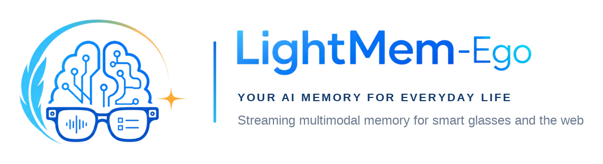
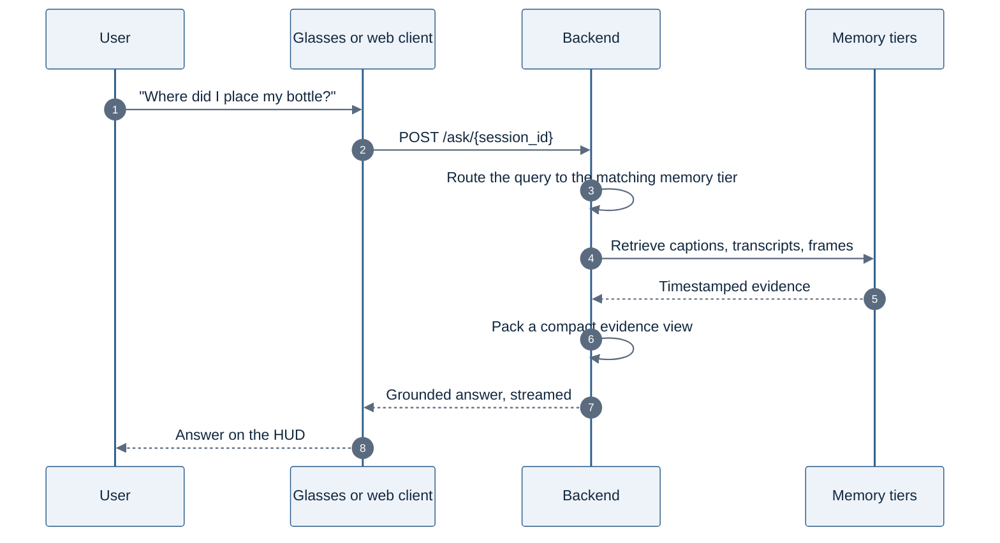

<div align="center">
  <picture>
    <source media="(prefers-color-scheme: dark)" srcset="./figs/banner_dark.png">
    
  </picture>
</div>

<p align="center">
  <b>Ask anything about what you saw and heard — streamed from smart glasses or the browser.</b>
</p>

<p align="center">
  <a href="https://arxiv.org/abs/2607.11487"></a>
  <a href="https://huggingface.co/papers/2607.11487"></a>
  <a href="https://arxiv.org/abs/2609.00551"></a>
  
  <a href="https://github.com/zjunlp/LightMem-Ego"></a>
  <a href="https://github.com/zjunlp/LightMem-Ego/blob/main/LICENSE"></a>
</p>

<p align="center">
  <a href="https://lightmem-ego.zjukg.cn/"><b>🌐 Try the Live Demo</b></a> &nbsp;·&nbsp;
  <a href="https://github.com/zjunlp/LightMem-Ego/releases/download/v1.0.0/app-release.apk"><b>📱 Download the Glasses APK</b></a> &nbsp;·&nbsp;
  <a href="https://www.bilibili.com/video/BV1oANw62EA3/"><b>🎬 Watch the Demo</b></a>
</p>

<h5 align="center">⭐ If LightMem-Ego is useful to you, please give us a star — it really helps!</h5>

<p align="center">
  
  
  
  
  
  
</p>

<div align="center">
  <picture>
    <source media="(prefers-color-scheme: dark)" srcset="./figs/stat_strip_dark.png">
    
  </picture>
</div>

<details>
<summary><b>📑 Table of contents</b></summary>

- [🎬 Demo](#demo)
- [📢 News](#news)
- [✨ Highlights](#highlights)
- [🆚 How It Compares](#comparison)
- [💬 What You Can Ask](#scenarios)
- [🚀 Quick Start](#quick-start)
- [🏗️ How It Works](#architecture)
- [📊 Results](#results)
- [📦 Repository Layout](#repository-layout)
- [🗺️ Roadmap](#roadmap)
- [📄 Citation](#citation)
- [🔗 Related Projects](#related-works)
- [⚖️ License](#license)
- [🔐 Privacy](#privacy)

</details>

---

<span id="demo"></span>

## 🎬 Demo

Ask the glasses a question in the middle of your day, and get an answer grounded in what you actually saw and heard. Prefer typing? Join the same live session from the web page.

> [!TIP]
> **No hardware? Try it right now.** The [live web demo](https://lightmem-ego.zjukg.cn/) runs the whole system in your browser — nothing to install.

<p align="center">
  <a href="https://www.bilibili.com/video/BV1oANw62EA3/"></a>
  <br>
  <sub>Ask on the glasses → a memory-grounded answer on the HUD. Full demo:
  <a href="https://www.youtube.com/watch?v=BZuIxn00xlc">YouTube</a> ·
  <a href="https://www.bilibili.com/video/BV1oANw62EA3/">Bilibili</a></sub>
</p>

<table align="center">
  <tr>
    <td align="center" width="33%">
      
      <br><sub><b>Hands-free on Rokid AI Glasses</b><br>Ask by voice or preset question</sub>
    </td>
    <td align="center" width="33%">
      
      <br><sub><b>Answers grounded in memory</b><br>Timestamps + visual evidence</sub>
    </td>
    <td align="center" width="33%">
      
      <br><sub><b>Same session on the web</b><br>Type questions when speaking isn't convenient</sub>
    </td>
  </tr>
</table>

---

<span id="news"></span>

## 📢 News

- **[2026-09]** ✨ Multi-session support, online memory editing, and streaming answers land in the backend and web UI.
- **[2026-08]** 🎉🎉🎉 [**EM²Mem: Event-Centric Multimodal Memory for Large Language Models**](https://arxiv.org/abs/2609.00551) — the long-term memory engine behind this backend — has been accepted to **EMNLP 2026 Findings**!
- **[2026-07-13]** 📄 [**LightMem-Ego: Your AI Memory for Everyday Life**](https://arxiv.org/abs/2607.11487) is released on arXiv.
- **[2026-07]** 📦 **v1.0.0 released** — [download the Rokid AI Glass APK](https://github.com/zjunlp/LightMem-Ego/releases/tag/v1.0.0) and reproduce the full stack with [Docker](https://github.com/zjunlp/LightMem-Ego/blob/main/deploy/DOCKER.md).
- **[2026-05]** 🎉 [**LightMem-Ego: Your AI Memory for Everyday Life**](https://github.com/zjunlp/LightMem-Ego) is open-sourced.

---

<span id="highlights"></span>

## ✨ Highlights

- 🎥 **Always-on egocentric capture** — streams first-person camera frames and microphone audio from Rokid AI Glasses or a browser.
- 🧠 **Three-tier memory** — a rolling *current* memory, *short-term* micro-events, and consolidated *long-term* episodes, routines, and preferences.
- 🔍 **Memory-grounded answers** — each answer ships with timestamped visual and transcript evidence you can inspect.
- ⏱️ **Timeline-aligned multimodality** — frames, audio chunks, ASR transcripts, and metadata share one session timeline.
- 👓 **Glasses and web, one session** — start capture on the glasses, keep asking from the web page in the same live session.
- 🐳 **One-command reproduction** — `docker compose up --build` brings up the web UI plus the full backend worker pipeline.

---

<span id="comparison"></span>

## 🆚 How It Compares

Representative commercial assistants, text-based memory systems, and egocentric multimodal assistants. This compares publicly described capabilities rather than measured performance.

| System | Platform & input | Real-time A/V stream | Current / short-term MM memory | Long-term episodic | Long-term semantic | Timestamped evidence |
| :--- | :--- | :---: | :---: | :---: | :---: | :---: |
| ChatGPT Memory | Text chat | — | — | — | Partial | — |
| Mem0-style memory | Text and agent memory | — | Partial | — | ✓ | Partial |
| Memories.ai | Video archives and visual memory | Partial | Partial | ✓ | Partial | Partial |
| Gemini Live | Phone | ✓ | Partial | — | — | — |
| Ray-Ban Meta AI Glasses | Glasses | Partial | Partial | — | — | — |
| Vinci | Phone or wearable camera | ✓ | ✓ | Partial | Partial | Partial |
| VisualClaw | Streaming video with agent workspace | Partial | Partial | — | Partial | Partial |
| VisionClaw | Smart glasses | ✓ | Partial | — | — | Partial |
| Egocentric Co-Pilot | Smart glasses with web agents | ✓ | ✓ | Partial | Partial | Partial |
| EgoButler | AI-glasses egocentric video and audio | Partial | Partial | Partial | Partial | ✓ |
| **LightMem-Ego** | **Phone and glasses-style client** | **✓** | **✓** | **✓** | **✓** | **✓** |

**✓** implemented as an explicit first-class component · **Partial** limited, implicit, offline, session-level, or modality-restricted · **—** not explicitly supported or not publicly described. Adapted from the [LightMem-Ego paper](https://arxiv.org/abs/2607.11487).

---

<span id="scenarios"></span>

## 💬 What You Can Ask

| Scenario | Example question | Memory used |
| :--- | :--- | :--- |
| **Object finding** | "Where did I leave my badge?" | Current + short-term |
| **Conversation recall** | "What did the doctor tell me after checking the report?" | Short-term + transcript |
| **Day summarization** | "What did I do this afternoon?" | Short-term + long-term |
| **Routine discovery** | "What do I usually do after arriving at the office?" | Long-term semantic |
| **Live assistance** | "What am I looking at right now?" | Current |

---

<span id="quick-start"></span>

## 🚀 Quick Start

> [!IMPORTANT]
> **Bring two things:** an OpenAI-compatible LLM endpoint (base URL, API key, model names), and [Xfyun](https://www.xfyun.cn/) ASR credentials if you want speech transcribed. Local embedding models and a GPU are optional — the Docker stack starts without them.

### Option 1 — Docker (recommended)

```bash
git clone https://github.com/zjunlp/LightMem-Ego.git
cd LightMem-Ego
cp deploy/.env.example .env     # fill in your LLM endpoint, keys, and model names
docker compose up --build
```

Open **http://localhost:8080**. The web container proxies `/api` to the backend, so no CORS setup is needed.

> [!NOTE]
> The first build takes a few minutes. Visual embeddings default to `mock` so the stack starts without model weights — enable the GPU profiles in [`deploy/DOCKER.md`](deploy/DOCKER.md) for full visual and text retrieval.

See [`deploy/DOCKER.md`](deploy/DOCKER.md) for optional GPU model services, SRS/RTMP live ingest, and data persistence.

### Option 2 — Run the components directly

<details>
<summary><b>Web frontend</b> (Node.js + npm)</summary>

```bash
cd src/frontend/online_web
npm install
npm run dev
```

Point it at your backend by creating `online_web/.env.local`:

```bash
VITE_API_BASE_URL=http://127.0.0.1:8000
```

Details: [`src/frontend/README.md`](src/frontend/README.md)

</details>

<details>
<summary><b>Backend</b> (Python 3.10+, ffmpeg/ffprobe)</summary>

```bash
cd src/backend
python -m venv .venv && source .venv/bin/activate
python -m pip install --upgrade pip && python -m pip install -e .
cp .env.example .env            # configure model paths and API credentials
scripts/start_api.sh
scripts/start_online_all_workers.sh
```

Details: [`src/backend/README.md`](src/backend/README.md) and [`DEPLOYMENT.md`](src/backend/DEPLOYMENT.md).

</details>

<details>
<summary><b>Rokid AI Glass app</b> (install the APK, or build from source)</summary>

Install the released APK:

```bash
adb install -r app-release.apk
```

Or build it yourself (JDK + Android SDK):

```bash
cd src/ai_glass_app
./gradlew assembleDebug        # Windows: .\gradlew.bat assembleDebug
```

Point the app at your backend in
[`LightMemEgoConfig.kt`](src/ai_glass_app/app/src/main/java/cn/zjukg/lightmem/glass/lightmem_ego/LightMemEgoConfig.kt).

Details: [`src/ai_glass_app/README.md`](src/ai_glass_app/README.md)

</details>

---

<span id="architecture"></span>

## 🏗️ How It Works

<div align="center">
  
</div>

```text
Rokid AI Glasses ─┐
                  ├─► Stream API ─► M_cur ─► M_st ─► M_lt ─► Retrieval ─► Answer + Evidence
Browser (web) ────┘                 current  short   long
```

| Memory tier | Scope | Example |
| :--- | :--- | :--- |
| **`M_cur`** current memory | The ongoing scene, updated as frames arrive | "What am I looking at?" |
| **`M_st`** short-term memory | Recent micro-events, actions, and conversations | "What did she just tell me?" |
| **`M_lt`** long-term memory | Consolidated episodes, routines, preferences, semantic facts | "What do I usually do on Fridays?" |

The backend divides each session into short event anchors and stores multimodal evidence per anchor. The long-term tier (`M_lt`) is built by **EM²Mem**, our event-centric multimodal memory framework (EMNLP 2026 Findings, [arXiv:2609.00551](https://arxiv.org/abs/2609.00551)): events are the retrieval unit, and episodic and semantic graphs link them across a session. At query time the system retrieves aligned event-level evidence — captions, transcripts, frames, timestamps — instead of reconstructing context at inference.

<div align="center">
  
</div>

*EM²Mem in one picture. A video is segmented into 30-second event anchors, and each anchor becomes a memory cell holding dense captions, transcripts, keyframes, and metadata. Episodic and semantic graphs link those cells, and retrieval reads grounded evidence from them instead of re-aligning raw fragments at query time.*

### Query lifecycle



---

<span id="results"></span>

## 📊 Results

### End-to-end system — LightMem-Ego

> [!NOTE]
> These numbers come from a small-batch everyday-life dataset we collected with the phone and glasses clients — not a public leaderboard. All latencies are end-to-end (question → answer). Reported in the [LightMem-Ego paper](https://arxiv.org/abs/2607.11487).

**Retrieval accuracy** — Recall@k over the retrieved memory entries, with MRR for the first relevant hit:

| Scenario | R@1 | R@3 | R@5 | MRR |
| :--- | :---: | :---: | :---: | :---: |
| Object finding | 22.2 | 66.7 | 77.8 | 0.454 |
| Conversation recall | 44.4 | 55.6 | 55.6 | 0.481 |
| Life summarization | 88.9 | 100.0 | 100.0 | 0.944 |
| **Overall** | **51.9** | **74.1** | **77.8** | **0.627** |

**Answer accuracy** — experience QA over daily scenarios:

| Scenario | LLM-Judge | Human |
| :--- | :---: | :---: |
| Object finding | 44.4 | 55.6 |
| Conversation recall | 33.3 | 33.3 |
| Life summarization | 77.8 | 77.8 |
| **Overall** | **51.9** | **55.6** |

**Latency** — P50 / P90 across two client profiles:

| Stage | Phone P50 | Phone P90 | Glasses P50 | Glasses P90 |
| :--- | :---: | :---: | :---: | :---: |
| *Short-term memory QA* | | | | |
| Retrieval | 13 ms | 15 ms | 14 ms | 29 ms |
| Answer generation | 5.77 s | 10.38 s | 6.10 s | 9.79 s |
| **End-to-end** | **5.86 s** | **10.95 s** | **7.01 s** | **9.96 s** |
| *Long-term memory QA* | | | | |
| Retrieval | 4.09 s | 15.39 s | 10.39 s | 28.93 s |
| Answer generation | 9.00 s | 22.40 s | 9.25 s | 22.62 s |
| **End-to-end** | **14.87 s** | **35.15 s** | **19.96 s** | **42.70 s** |

*Glasses columns are the glasses-style client profile.*

### Long-term memory engine — EM²Mem

The long-term tier (`M_lt`) is built by EM²Mem. Average accuracy (%) across three long-video and egocentric benchmarks, as reported in the EM²Mem paper:

| Method | EgoLifeQA | Ego-R1 Bench | Video-MME (L) |
| :--- | :---: | :---: | :---: |
| GPT-5 | 48.6 | 46.3 | 74.3 |
| HippoRAG | 59.6 | 56.0 | 52.1 |
| M3-Agent | 53.5 | 52.0 | 55.3 |
| Ego-R1 | 53.0 | 52.0 | 42.7 |
| WorldMM | 65.6 | 65.3 | 76.6 |
| **EM²Mem** | **66.0** | **67.7** | **76.8** |

Against the strongest baseline (WorldMM, reproduced under the same evaluation setting):

| Metric | EM²Mem | WorldMM | Gain |
| :--- | :---: | :---: | :---: |
| Avg. latency per query | **98.21 s** | 459.00 s | 4.67× faster |
| Wall-clock evaluation time | **6,138 s** | 229,502 s | 37.4× faster |
| Total tokens | **15.27M** | 42.03M | 63.7% fewer |

EM²Mem moves multimodal alignment and graph organization into offline memory construction, so inference reads from pre-built event-indexed memory cells instead of re-aligning isolated fragments. Full per-category tables are in the [backend README](src/backend/README.md#results); reproduction scripts in [`experiments/egolife`](https://github.com/zjunlp/LightMem/tree/main/experiments/egolife#results).

---

<span id="repository-layout"></span>

## 📦 Repository Layout

| Path | What's inside | Docs |
| :--- | :--- | :--- |
| [`src/ai_glass_app/`](src/ai_glass_app/) | Android app for Rokid AI Glasses (Kotlin, Jetpack Compose, CameraX) | [README](src/ai_glass_app/README.md) |
| [`src/frontend/`](src/frontend/) | Vite + React web UI for capture, sessions, QA, and evidence review | [README](src/frontend/README.md) |
| [`src/backend/`](src/backend/) | FastAPI service plus the online worker pipeline (ASR, memory, retrieval, QA) | [README](src/backend/README.md) |
| [`compose.yaml`](compose.yaml), [`deploy/`](deploy/) | Docker Compose stack and deployment notes | [DOCKER.md](deploy/DOCKER.md) |

---

<span id="roadmap"></span>

## 🗺️ Roadmap

- [ ] Publish end-to-end evaluation numbers and reproduction scripts in this repository.
- [ ] Pluggable ASR, VLM, and embedding backends beyond the current defaults.
- [ ] Support wearable devices beyond Rokid AI Glass.
- [ ] On-device filtering and user-controlled memory editing for privacy-sensitive capture.
- [ ] One-click deployment template for a full cloud deployment.

---

<span id="citation"></span>

## 📄 Citation

If you find LightMem-Ego useful, please cite our paper:

```bibtex
@article{chen2026lightmemego,
  title={LightMem-Ego: Your AI Memory for Everyday Life},
  author={Chen, Yijun and Xiao, Boyi and Zhao, Yixian and Xia, Haoting and Xu, Buqiang and Fang, Jizhan and Li, Yanya and Zheng, Yaqi and Wang, Xuehai and Xue, Zirui and others},
  journal={arXiv preprint arXiv:2607.11487},
  year={2026}
}
```

The long-term memory tier (`M_lt`) of the backend is built by **EM²Mem**, which has been accepted to **EMNLP 2026 Findings**. Please cite it as well when you use that module:

```bibtex
@article{chen2026em2mem,
  title={EM$^{2}$Mem: Event-Centric Multimodal Memory for Large Language Models},
  author={Chen, Yijun and Zheng, Yaqi and Li, Yanya and Xiao, Boyi and Xu, Buqiang and Qiao, Shuofei and Fang, Jizhan and Deng, Xinle and Yao, Yunzhi and Wang, Xuehai and others},
  journal={arXiv preprint arXiv:2609.00551},
  year={2026}
}
```

---

<span id="related-works"></span>

## 🔗 Related Projects

This repository belongs to the ZJUNLP **LightMem** series, which targets context bloat, excessive token consumption, and low cache utilization in long-running LLM agents:

- [LightMem](https://github.com/zjunlp/LightMem) — a lightweight and efficient memory management framework for LLMs and AI agents
- [LightRSI](https://github.com/zjunlp/LightRSI) — a modular framework for recursive improvement in long-horizon LLM agents
- [EM²Mem](https://arxiv.org/abs/2609.00551) **(EMNLP 2026 Findings)** — event-centric multimodal memory for long-video QA, and the long-term memory engine behind this system ([code overview](https://github.com/zjunlp/LightMem/blob/main/EM2Mem.md))

---

<span id="acknowledgements"></span>

## 🙏 Acknowledgements

LightMem-Ego builds on the broader line of work on memory-augmented agents, egocentric multimodal understanding, and wearable AI assistants. We thank all contributors and collaborators who helped develop the system.

---

<span id="license"></span>

## ⚖️ License

Released under the [MIT License](LICENSE).

---

<span id="privacy"></span>

## 🔐 Privacy

LightMem-Ego processes camera frames, microphone audio, transcripts, and generated memories. It is released for research and demonstration; a production deployment needs HTTPS, access control, encryption at rest, a data retention/deletion policy, and explicit user consent. Runtime media and memory are written to local, Git-ignored directories.

---

<span id="star-history"></span>

## ⭐ Star History

<div align="center">
  <a href="https://star-history.com/#zjunlp/LightMem-Ego&Date"></a>
</div>
